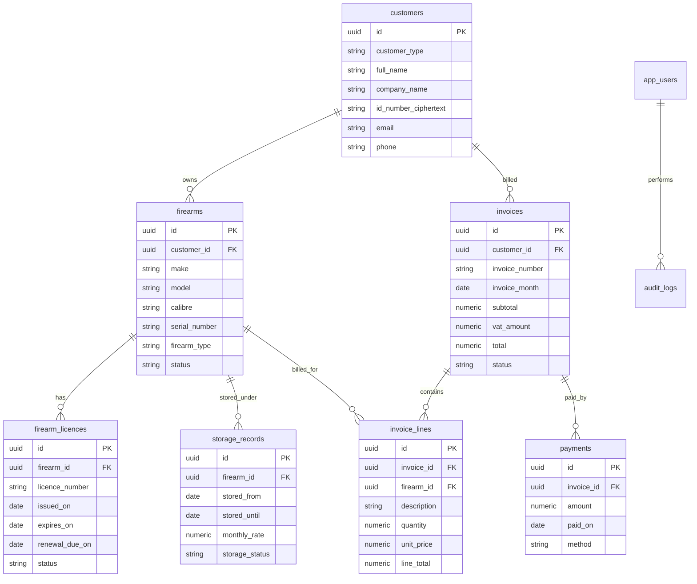

# South African Firearm Storage Database Scaffold

## Purpose

This document defines a practical database and API scaffold for a South African firearm storage management system.

The system must support:

- Viewing firearms currently in storage
- Identifying which firearms belong to which customer
- Tracking monthly storage fees per firearm
- Tracking licence renewal dates per firearm
- Generating and sending monthly invoices per customer

> Compliance note: This is a technical scaffold, not legal advice. Confirm all firearm storage, dealer, safe custody, invoicing, VAT, and POPIA obligations with a qualified South African legal/compliance professional before production use.

---

## Key South African Compliance Assumptions

### Firearm licence renewal

South African government guidance states that a firearm licence must be renewed at least **90 days before the expiry date**.

Source:

- https://www.gov.za/services/services-residents/dealing-law/firearms/apply-firearm-licence

Because of this, the system should calculate:

```txt
renewal_due_on = expires_on - 90 days
```

### POPIA and sensitive records

This system stores highly sensitive personal and firearm ownership information. It should be treated as a high-risk data system under South African privacy requirements.

The Information Regulator South Africa is the independent body established under POPIA.

Sources:

- https://inforegulator.org.za/
- https://inforegulator.org.za/about-2/

Sensitive data includes:

- Customer names
- ID numbers
- Contact details
- Firearm serial numbers
- Licence numbers
- Storage location details
- Licence document files
- Billing records

---

## High-Level System Requirements

### Customer requirements

A customer can be:

- An individual firearm owner
- A company
- A dealer
- An estate/trust/contact entity, if required later

Each customer should have:

- Name or company name
- Contact details
- Billing details
- Active/inactive status
- Firearms linked to them
- Monthly invoices

---

### Firearm requirements

Each firearm must have:

- Owner/customer
- Make
- Model
- Calibre
- Type
- Serial number
- Storage status
- Storage location
- Licence details
- Monthly storage rate

---

### Billing requirements

The system must:

- Bill monthly per firearm in active storage
- Generate one invoice per customer per month
- Add one invoice line per stored firearm
- Track invoice status
- Track payments
- Avoid duplicate invoices for the same customer and month

---

### Licence tracking requirements

The system must:

- Store licence number
- Store issue date, if known
- Store expiry date
- Calculate renewal due date
- Flag licences that are:
  - Valid
  - Due for renewal
  - Expired
  - Unknown

---

## Recommended Entity Relationship Diagram



---

## Core Tables

### Table summary

| Table | Purpose |
|---|---|
| `app_users` | Staff/admin users who access the system |
| `customers` | Firearm owners or paying customers |
| `firearms` | Firearms being stored |
| `firearm_licences` | Licence details and renewal dates |
| `storage_records` | Storage period, rate, and location |
| `invoices` | Monthly customer invoices |
| `invoice_lines` | One line per billed firearm |
| `payments` | Payment records against invoices |
| `audit_logs` | Sensitive change history |

---

## PostgreSQL Schema

```sql
CREATE EXTENSION IF NOT EXISTS "pgcrypto";

CREATE TYPE customer_type AS ENUM ('individual', 'company');
CREATE TYPE firearm_status AS ENUM ('in_storage', 'released', 'pending_transfer', 'inactive');
CREATE TYPE licence_status AS ENUM ('valid', 'renewal_due', 'expired', 'unknown');
CREATE TYPE storage_status AS ENUM ('active', 'released', 'cancelled');
CREATE TYPE invoice_status AS ENUM ('draft', 'sent', 'paid', 'overdue', 'cancelled');
CREATE TYPE payment_method AS ENUM ('eft', 'cash', 'card', 'debit_order', 'other');
CREATE TYPE app_role AS ENUM ('admin', 'manager', 'staff', 'viewer');

CREATE TABLE app_users (
    id UUID PRIMARY KEY DEFAULT gen_random_uuid(),
    email TEXT NOT NULL UNIQUE,
    full_name TEXT NOT NULL,
    role app_role NOT NULL DEFAULT 'staff',
    is_active BOOLEAN NOT NULL DEFAULT TRUE,
    created_at TIMESTAMPTZ NOT NULL DEFAULT now()
);

CREATE TABLE customers (
    id UUID PRIMARY KEY DEFAULT gen_random_uuid(),

    customer_type customer_type NOT NULL DEFAULT 'individual',

    -- Individual customer details
    full_name TEXT,
    id_number_ciphertext TEXT,

    -- Company customer details
    company_name TEXT,
    registration_number TEXT,
    vat_number TEXT,

    email TEXT,
    phone TEXT,

    address_line_1 TEXT,
    address_line_2 TEXT,
    city TEXT,
    province TEXT,
    postal_code TEXT,

    notes TEXT,

    is_active BOOLEAN NOT NULL DEFAULT TRUE,

    created_at TIMESTAMPTZ NOT NULL DEFAULT now(),
    updated_at TIMESTAMPTZ NOT NULL DEFAULT now(),

    CONSTRAINT customer_name_check CHECK (
        full_name IS NOT NULL OR company_name IS NOT NULL
    )
);

CREATE TABLE firearms (
    id UUID PRIMARY KEY DEFAULT gen_random_uuid(),

    customer_id UUID NOT NULL REFERENCES customers(id),

    make TEXT NOT NULL,
    model TEXT,
    calibre TEXT,
    firearm_type TEXT,

    serial_number TEXT NOT NULL UNIQUE,

    status firearm_status NOT NULL DEFAULT 'in_storage',

    internal_reference TEXT UNIQUE,
    notes TEXT,

    created_at TIMESTAMPTZ NOT NULL DEFAULT now(),
    updated_at TIMESTAMPTZ NOT NULL DEFAULT now()
);

CREATE TABLE firearm_licences (
    id UUID PRIMARY KEY DEFAULT gen_random_uuid(),

    firearm_id UUID NOT NULL REFERENCES firearms(id) ON DELETE CASCADE,

    licence_number TEXT NOT NULL,
    issued_on DATE,
    expires_on DATE NOT NULL,

    -- South African renewal tracking: 90 days before expiry
    renewal_due_on DATE GENERATED ALWAYS AS (expires_on - 90) STORED,

    status licence_status NOT NULL DEFAULT 'valid',

    document_url TEXT,

    created_at TIMESTAMPTZ NOT NULL DEFAULT now(),
    updated_at TIMESTAMPTZ NOT NULL DEFAULT now(),

    UNIQUE (firearm_id, licence_number)
);

CREATE TABLE storage_records (
    id UUID PRIMARY KEY DEFAULT gen_random_uuid(),

    firearm_id UUID NOT NULL REFERENCES firearms(id),

    stored_from DATE NOT NULL DEFAULT CURRENT_DATE,
    stored_until DATE,

    monthly_rate NUMERIC(12, 2) NOT NULL,

    storage_status storage_status NOT NULL DEFAULT 'active',

    storage_location TEXT,
    rack_number TEXT,
    safe_number TEXT,

    notes TEXT,

    created_at TIMESTAMPTZ NOT NULL DEFAULT now(),
    updated_at TIMESTAMPTZ NOT NULL DEFAULT now(),

    CONSTRAINT storage_date_check CHECK (
        stored_until IS NULL OR stored_until >= stored_from
    )
);

CREATE TABLE invoices (
    id UUID PRIMARY KEY DEFAULT gen_random_uuid(),

    customer_id UUID NOT NULL REFERENCES customers(id),

    invoice_number TEXT NOT NULL UNIQUE,

    -- Store as the first day of the invoice month, for example: 2026-06-01
    invoice_month DATE NOT NULL,

    subtotal NUMERIC(12, 2) NOT NULL DEFAULT 0,
    vat_amount NUMERIC(12, 2) NOT NULL DEFAULT 0,
    total NUMERIC(12, 2) NOT NULL DEFAULT 0,

    status invoice_status NOT NULL DEFAULT 'draft',

    sent_at TIMESTAMPTZ,
    due_on DATE,

    created_at TIMESTAMPTZ NOT NULL DEFAULT now(),
    updated_at TIMESTAMPTZ NOT NULL DEFAULT now(),

    UNIQUE (customer_id, invoice_month)
);

CREATE TABLE invoice_lines (
    id UUID PRIMARY KEY DEFAULT gen_random_uuid(),

    invoice_id UUID NOT NULL REFERENCES invoices(id) ON DELETE CASCADE,
    firearm_id UUID REFERENCES firearms(id),

    description TEXT NOT NULL,

    quantity NUMERIC(12, 2) NOT NULL DEFAULT 1,
    unit_price NUMERIC(12, 2) NOT NULL,
    line_total NUMERIC(12, 2) NOT NULL,

    created_at TIMESTAMPTZ NOT NULL DEFAULT now()
);

CREATE TABLE payments (
    id UUID PRIMARY KEY DEFAULT gen_random_uuid(),

    invoice_id UUID NOT NULL REFERENCES invoices(id),

    amount NUMERIC(12, 2) NOT NULL,
    paid_on DATE NOT NULL DEFAULT CURRENT_DATE,
    method payment_method NOT NULL DEFAULT 'eft',

    reference TEXT,
    notes TEXT,

    created_at TIMESTAMPTZ NOT NULL DEFAULT now()
);

CREATE TABLE audit_logs (
    id UUID PRIMARY KEY DEFAULT gen_random_uuid(),

    app_user_id UUID REFERENCES app_users(id),

    entity_type TEXT NOT NULL,
    entity_id UUID NOT NULL,

    action TEXT NOT NULL,
    old_value JSONB,
    new_value JSONB,

    created_at TIMESTAMPTZ NOT NULL DEFAULT now()
);
```

---

## Recommended Indexes

```sql
CREATE INDEX idx_firearms_customer_id ON firearms(customer_id);
CREATE INDEX idx_firearms_serial_number ON firearms(serial_number);
CREATE INDEX idx_firearms_status ON firearms(status);

CREATE INDEX idx_licences_firearm_id ON firearm_licences(firearm_id);
CREATE INDEX idx_licences_expires_on ON firearm_licences(expires_on);
CREATE INDEX idx_licences_renewal_due_on ON firearm_licences(renewal_due_on);

CREATE INDEX idx_storage_records_firearm_id ON storage_records(firearm_id);

CREATE INDEX idx_storage_records_active
ON storage_records(firearm_id)
WHERE storage_status = 'active';

CREATE INDEX idx_invoices_customer_month ON invoices(customer_id, invoice_month);
CREATE INDEX idx_invoices_status ON invoices(status);

CREATE INDEX idx_invoice_lines_invoice_id ON invoice_lines(invoice_id);
CREATE INDEX idx_invoice_lines_firearm_id ON invoice_lines(firearm_id);

CREATE INDEX idx_payments_invoice_id ON payments(invoice_id);
```

---

## Recommended Views

### Active firearms in storage

```sql
CREATE VIEW active_firearms_in_storage AS
SELECT
    f.id AS firearm_id,
    f.make,
    f.model,
    f.calibre,
    f.firearm_type,
    f.serial_number,
    f.status AS firearm_status,

    c.id AS customer_id,
    COALESCE(c.full_name, c.company_name) AS customer_name,
    c.email,
    c.phone,

    sr.id AS storage_record_id,
    sr.stored_from,
    sr.monthly_rate,
    sr.storage_location,
    sr.rack_number,
    sr.safe_number,

    fl.licence_number,
    fl.expires_on,
    fl.renewal_due_on,
    fl.status AS licence_status
FROM firearms f
JOIN customers c ON c.id = f.customer_id
JOIN storage_records sr ON sr.firearm_id = f.id
LEFT JOIN firearm_licences fl ON fl.firearm_id = f.id
WHERE sr.storage_status = 'active'
  AND sr.stored_until IS NULL;
```

### Customer monthly storage totals

```sql
CREATE VIEW customer_monthly_storage_totals AS
SELECT
    c.id AS customer_id,
    COALESCE(c.full_name, c.company_name) AS customer_name,
    COUNT(f.id) AS firearms_in_storage,
    SUM(sr.monthly_rate) AS monthly_storage_total
FROM customers c
JOIN firearms f ON f.customer_id = c.id
JOIN storage_records sr ON sr.firearm_id = f.id
WHERE sr.storage_status = 'active'
  AND sr.stored_until IS NULL
GROUP BY c.id, COALESCE(c.full_name, c.company_name);
```

---

## Monthly Invoice Generation Logic

### Billing rules

For each invoice month:

1. Find all firearms that were in active storage during that month.
2. Group firearms by customer.
3. Create one invoice per customer.
4. Add one invoice line per firearm.
5. Calculate subtotal.
6. Calculate VAT if applicable.
7. Calculate total.
8. Keep invoice as `draft`.
9. Send the invoice to the customer.
10. Mark the invoice as `sent`.

---

### Query to find billable firearms for a month

Example for June 2026:

```sql
SELECT
    c.id AS customer_id,
    COALESCE(c.full_name, c.company_name) AS customer_name,
    c.email,
    f.id AS firearm_id,
    f.make,
    f.model,
    f.serial_number,
    sr.monthly_rate
FROM storage_records sr
JOIN firearms f ON f.id = sr.firearm_id
JOIN customers c ON c.id = f.customer_id
WHERE sr.storage_status = 'active'
  AND sr.stored_from <= DATE '2026-06-30'
  AND (
      sr.stored_until IS NULL
      OR sr.stored_until >= DATE '2026-06-01'
  )
ORDER BY customer_name, f.serial_number;
```

---

### Invoice number strategy

Recommended format:

```txt
INV-YYYYMM-0001
```

Example:

```txt
INV-202606-0001
INV-202606-0002
INV-202606-0003
```

---

### Invoice line description strategy

Recommended invoice line format:

```txt
Storage fee - Make Model - Serial: SERIAL_NUMBER - Month YYYY
```

Example:

```txt
Storage fee - Glock 19 - Serial: ABC12345 - June 2026
```

---

## Licence Renewal Queries

### Licences due for renewal in the next 30 days

```sql
SELECT
    c.id AS customer_id,
    COALESCE(c.full_name, c.company_name) AS customer_name,
    c.email,
    c.phone,

    f.id AS firearm_id,
    f.make,
    f.model,
    f.serial_number,

    fl.licence_number,
    fl.expires_on,
    fl.renewal_due_on
FROM firearm_licences fl
JOIN firearms f ON f.id = fl.firearm_id
JOIN customers c ON c.id = f.customer_id
WHERE fl.renewal_due_on BETWEEN CURRENT_DATE AND CURRENT_DATE + INTERVAL '30 days'
ORDER BY fl.renewal_due_on ASC;
```

---

### Expired licences

```sql
SELECT
    c.id AS customer_id,
    COALESCE(c.full_name, c.company_name) AS customer_name,
    c.email,
    c.phone,

    f.id AS firearm_id,
    f.make,
    f.model,
    f.serial_number,

    fl.licence_number,
    fl.expires_on
FROM firearm_licences fl
JOIN firearms f ON f.id = fl.firearm_id
JOIN customers c ON c.id = f.customer_id
WHERE fl.expires_on < CURRENT_DATE
ORDER BY fl.expires_on ASC;
```

---

### Update licence statuses

This can be run daily as a scheduled job.

```sql
UPDATE firearm_licences
SET status = CASE
    WHEN expires_on < CURRENT_DATE THEN 'expired'::licence_status
    WHEN renewal_due_on <= CURRENT_DATE THEN 'renewal_due'::licence_status
    ELSE 'valid'::licence_status
END,
updated_at = now();
```

---

## Suggested API Endpoints

### Customers

```txt
GET    /customers
GET    /customers/:id
POST   /customers
PATCH  /customers/:id
GET    /customers/:id/firearms
GET    /customers/:id/invoices
```

---

### Firearms

```txt
GET    /firearms
GET    /firearms/:id
POST   /firearms
PATCH  /firearms/:id
GET    /firearms/storage/active
GET    /firearms/:id/licences
```

---

### Licences

```txt
GET    /licences/due-renewal
GET    /licences/expired
POST   /firearms/:id/licences
PATCH  /licences/:id
```

---

### Storage

```txt
POST   /firearms/:id/storage
PATCH  /storage-records/:id/release
GET    /storage/active
GET    /storage/customer/:customerId
```

---

### Invoices

```txt
POST   /invoices/generate-monthly
GET    /invoices
GET    /invoices/:id
POST   /invoices/:id/send
POST   /invoices/:id/payments
PATCH  /invoices/:id/cancel
```

---

### Reports

```txt
GET    /reports/firearms-in-storage
GET    /reports/customer-balances
GET    /reports/licence-renewals
GET    /reports/monthly-storage-revenue
```

---

## Example API DTOs

### Create customer

```json
{
  "customerType": "individual",
  "fullName": "John Smith",
  "idNumber": "9001015009087",
  "email": "john@example.com",
  "phone": "+27821234567",
  "addressLine1": "10 Main Road",
  "city": "Cape Town",
  "province": "Western Cape",
  "postalCode": "8001"
}
```

---

### Create firearm

```json
{
  "customerId": "8e7d9c01-9d2e-4f6a-a05e-c38d991af123",
  "make": "Glock",
  "model": "19",
  "calibre": "9mm",
  "firearmType": "Pistol",
  "serialNumber": "ABC12345",
  "internalReference": "FA-000001"
}
```

---

### Create firearm licence

```json
{
  "firearmId": "4c98f7f9-f3d5-4f1e-b589-86d6a6f20112",
  "licenceNumber": "123456789",
  "issuedOn": "2021-08-15",
  "expiresOn": "2026-08-15"
}
```

---

### Start firearm storage

```json
{
  "firearmId": "4c98f7f9-f3d5-4f1e-b589-86d6a6f20112",
  "storedFrom": "2026-06-01",
  "monthlyRate": 250.00,
  "storageLocation": "Main Safe Room",
  "safeNumber": "Safe A",
  "rackNumber": "Rack 12"
}
```

---

### Generate monthly invoices

```json
{
  "invoiceMonth": "2026-06-01",
  "vatRate": 15,
  "dueDays": 7
}
```

---

## Dashboard Requirements

### Main dashboard

Show:

- Total firearms in storage
- Total customers
- Monthly recurring storage revenue
- Invoices outstanding
- Overdue invoices
- Licences due for renewal
- Expired licences

---

### Customer detail page

Show:

- Customer details
- Firearms owned
- Active storage records
- Monthly storage total
- Licence renewal warnings
- Invoices
- Payments
- Notes

---

### Firearm detail page

Show:

- Owner
- Make/model/calibre/type
- Serial number
- Licence details
- Storage location
- Storage history
- Billing history
- Audit history

---

### Billing dashboard

Show:

- Invoice month
- Customer
- Number of firearms billed
- Subtotal
- VAT
- Total
- Status
- Due date
- Paid date

---

## Security Requirements

Because this system handles sensitive firearm ownership and licence information, it should not be treated as a basic CRUD app.

Minimum recommended controls:

- Role-based access control
- MFA for admin users
- Audit logging for all sensitive changes
- Encryption for ID numbers
- Encryption for licence documents at rest
- Private file storage only
- No public firearm or licence document URLs
- Strict staff permissions
- Database backups
- Soft deletes instead of hard deletes
- Virus scanning on file uploads
- Session timeout
- IP/device logging for admin activity
- Principle of least privilege for database access

---

## Recommended Roles

| Role | Permissions |
|---|---|
| `admin` | Full access |
| `manager` | Manage customers, firearms, storage, invoices |
| `staff` | View/update storage and licence records |
| `viewer` | Read-only access |

---

## Audit Log Events

Track at minimum:

- Customer created
- Customer updated
- Firearm created
- Firearm owner changed
- Firearm released from storage
- Licence created
- Licence expiry changed
- Invoice generated
- Invoice sent
- Payment recorded
- Sensitive document uploaded
- Sensitive document viewed
- User login
- User failed login

---

## MVP Build Order

### Phase 1: Core database

Build:

- `customers`
- `firearms`
- `firearm_licences`
- `storage_records`
- `app_users`
- `audit_logs`

Goal:

- Capture customers
- Capture firearms
- Link firearms to owners
- Track licence renewal dates
- Track active storage

---

### Phase 2: Billing

Build:

- `invoices`
- `invoice_lines`
- `payments`
- Monthly invoice generator
- Invoice PDF/email sending

Goal:

- Generate monthly invoices per customer
- Track invoice status
- Track payments

---

### Phase 3: Reporting and reminders

Build:

- Licence renewal reminders
- Expired licence report
- Customer balance report
- Monthly revenue report

Goal:

- Give staff actionable operational views

---

### Phase 4: Security hardening

Build:

- MFA
- Document encryption
- Audit reporting
- Staff permissions
- Backup policy
- Data retention policy

Goal:

- Prepare system for production handling of sensitive records

---

## Recommended Project Structure

Example backend structure:

```txt
src/
  modules/
    customers/
      customers.controller.ts
      customers.service.ts
      customers.repository.ts
      customers.dto.ts

    firearms/
      firearms.controller.ts
      firearms.service.ts
      firearms.repository.ts
      firearms.dto.ts

    licences/
      licences.controller.ts
      licences.service.ts
      licences.repository.ts
      licences.dto.ts

    storage/
      storage.controller.ts
      storage.service.ts
      storage.repository.ts
      storage.dto.ts

    invoices/
      invoices.controller.ts
      invoices.service.ts
      invoices.repository.ts
      invoices.dto.ts

    payments/
      payments.controller.ts
      payments.service.ts
      payments.repository.ts
      payments.dto.ts

    audit/
      audit.service.ts
      audit.repository.ts

  database/
    migrations/
    seeds/

  shared/
    auth/
    errors/
    logger/
    mailer/
    storage/
```

---

## Critical Design Notes

### Billing should come from `storage_records`

Do not bill directly from the `firearms` table.

Reason:

- A firearm can enter storage mid-month.
- A firearm can leave storage.
- A customer can have historical firearms no longer in storage.
- Monthly rates can change over time.
- Historical invoices must remain accurate.

The `storage_records` table preserves billing history.

---

### Firearm ownership should be explicit

Every firearm should belong to a customer through `customer_id`.

If you later need ownership transfers, add a `firearm_ownership_history` table instead of overwriting history blindly.

Suggested future table:

```sql
CREATE TABLE firearm_ownership_history (
    id UUID PRIMARY KEY DEFAULT gen_random_uuid(),
    firearm_id UUID NOT NULL REFERENCES firearms(id),
    customer_id UUID NOT NULL REFERENCES customers(id),
    owned_from DATE NOT NULL,
    owned_until DATE,
    created_at TIMESTAMPTZ NOT NULL DEFAULT now()
);
```

---

### Storage history should never be deleted

When a firearm is released from storage:

- Set `stored_until`
- Set `storage_status = 'released'`
- Keep the record for history and invoicing

Example:

```sql
UPDATE storage_records
SET
    stored_until = CURRENT_DATE,
    storage_status = 'released',
    updated_at = now()
WHERE id = :storage_record_id;
```

---

## Final MVP Checklist

- [ ] Customers can be created
- [ ] Firearms can be created
- [ ] Firearms are linked to customers
- [ ] Firearms can be marked as in storage
- [ ] Monthly rate is stored per firearm storage record
- [ ] Licence expiry date is captured
- [ ] Renewal due date is calculated
- [ ] Active storage dashboard exists
- [ ] Monthly invoice generation exists
- [ ] Invoice lines are generated per firearm
- [ ] Payments can be recorded
- [ ] Audit logs are written for sensitive changes
- [ ] Sensitive customer data is encrypted where needed
- [ ] Staff roles are enforced
